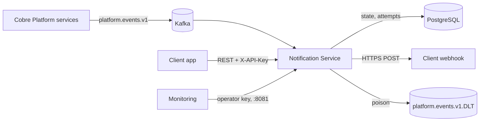
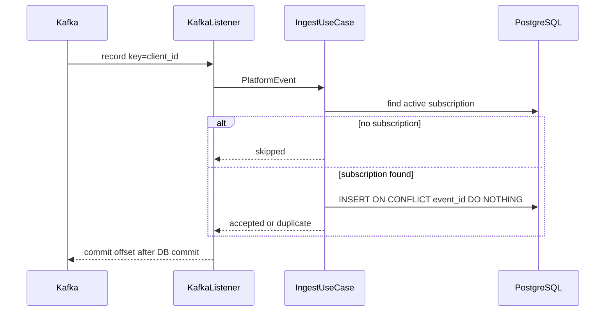
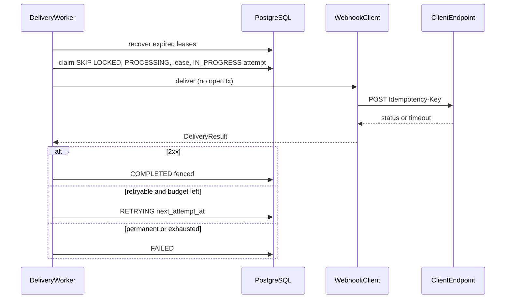
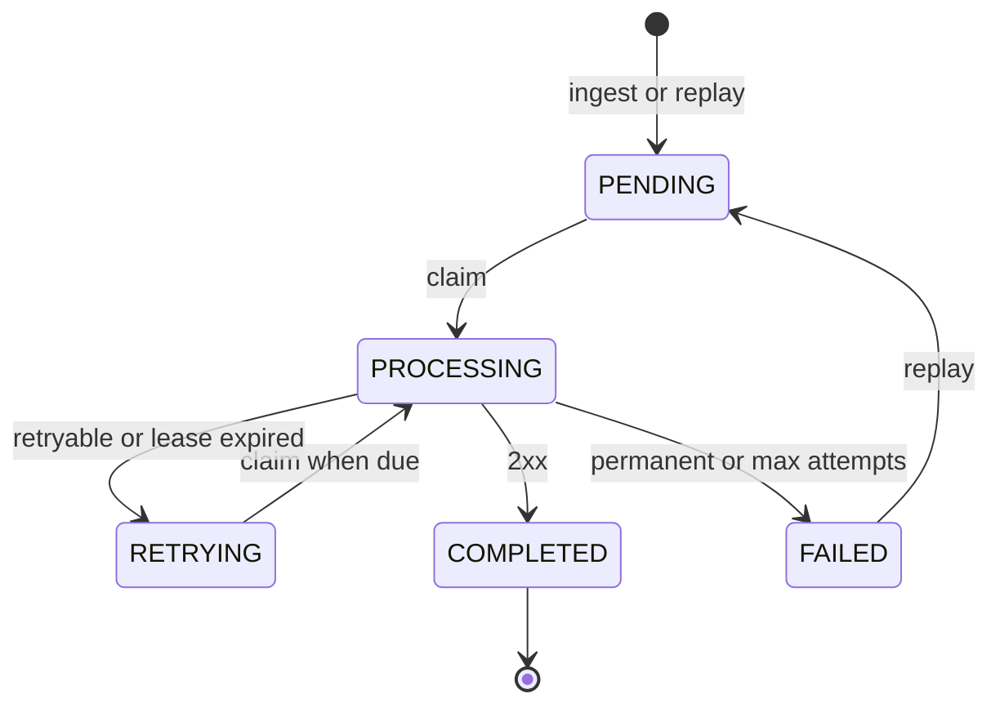
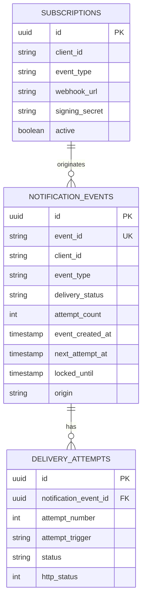

# Architecture

One Spring Boot process, three inbound adapters (Kafka, scheduled worker, REST) and three outbound
adapters (PostgreSQL, HTTPS webhook, Micrometer). Domain and application have no Spring, JPA, Kafka
or `java.net.http`.

Horizontal scale: more identical instances. Kafka partitions by `client_id`. Workers compete with
`FOR UPDATE SKIP LOCKED` and a lease. HTTP never runs inside a database transaction.

## C4 containers

## Ingest

The listener does not call HTTP. Invalid JSON goes to the DLT (`notification.dlt.published`).
Transient DB errors retry without committing the offset.

## Delivery and retry

The guard runs before HTTP. Redirects are never followed. HMAC is added only when
`signing_secret` is set on the active subscription at claim time.

## NotificationEvent states

`cycle_attempt_count` is the retry budget; replay resets it. `attempt_count` never decreases.

## Persistence

Flyway `V1` + `V2` (`signing_secret`). `ddl-auto=validate`. Seeded fixture rows use `origin=FIXTURE`
and one synthetic attempt (`error_code=fixture_synthetic`).

## Scale and failure

- More app instances: more consumer threads and more claim workers.
- Kafka down: no new ingest; API and retries continue.
- PostgreSQL down: ingest retries (lag grows); API 503; worker waits.
- Webhook down: persisted backoff, then FAILED; replay when it is back.
- Worker crash: lease expires; another worker abandons the in-flight attempt and retries or fails.
- Poison message: DLT, partition keeps moving.

ADRs: [ADR-001](adr/ADR-001-hexagonal-and-boot.md) … [ADR-007](adr/ADR-007-api-keys-and-operator-audit.md).
