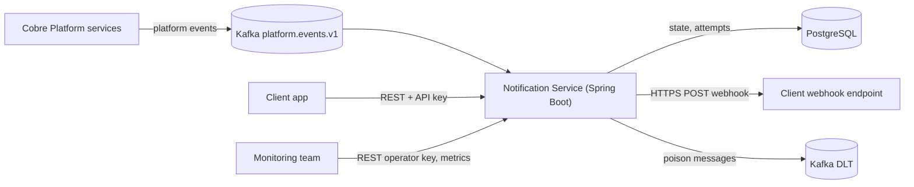
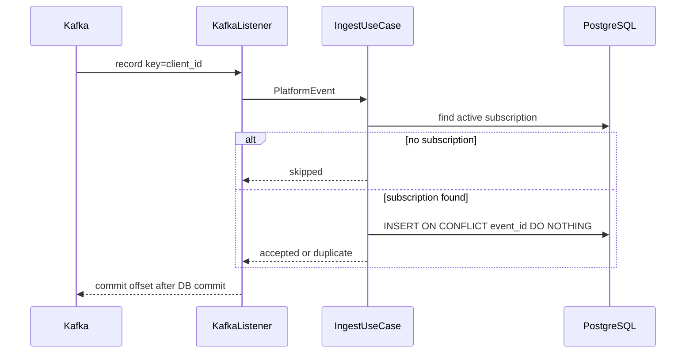
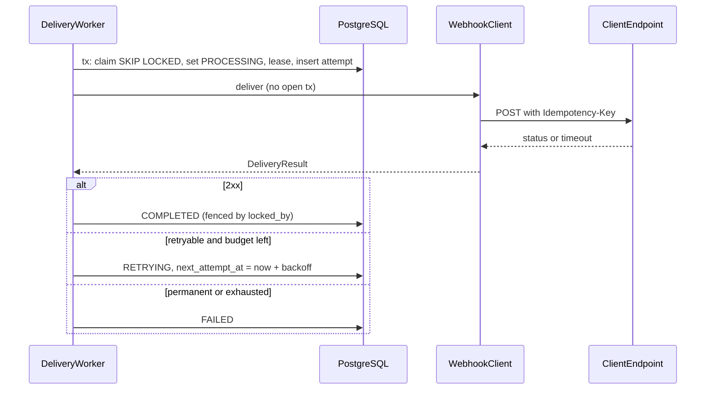
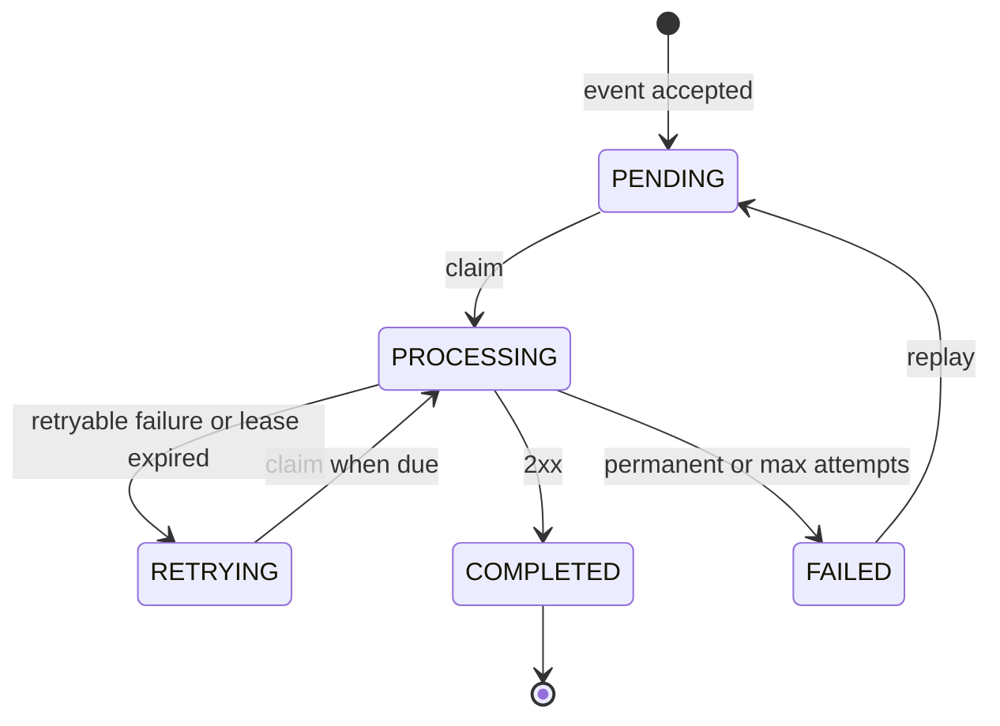
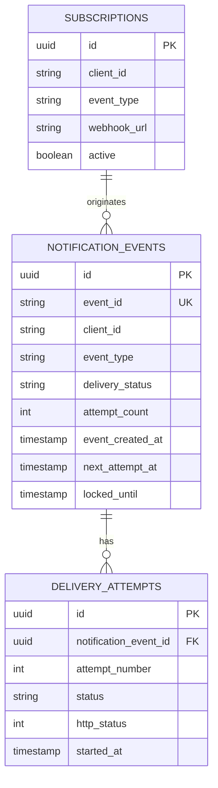


# Cobre Notification Service - Analysis and Implementation Plan

Fuentes analizadas: [challenge.md](../challenge.md) (texto del PDF), [notification_events.json](../notification_events.json), [build.gradle](../build.gradle) (Spring Boot **4.1.1**, Java 21 — se mantiene por decisión de Pablo, sujeto a la regla de corte de la Fase 0).

Versión del plan: **v2** (aprobado con ajustes). Las secciones modificadas respecto de v1 están marcadas con `[v2]`.

---

## 1. Executive Summary

Servicio único (`cobre-notification-service`) con dos responsabilidades desacopladas:

- **Delivery pipeline**: consume platform events desde Kafka, valida subscription activa `(client_id, event_type)`, persiste una `NotificationEvent` en PostgreSQL (idempotente por `event_id`), hace ack a Kafka, y un **delivery worker** (poller con `FOR UPDATE SKIP LOCKED` + lease) entrega el webhook vía HTTPS fuera de toda transacción, con retries persistidos (exponential backoff + jitter) y historial completo de intentos.
- **Self-service API**: `GET /notification_events`, `GET /notification_events/{id}`, `POST /notification_events/{id}/replay`, autenticada por API key con tenant derivado de la key (nunca del request).

Semántica **at-least-once**, PostgreSQL como fuente de verdad del estado de delivery, Kafka solo para ingesta. Hexagonal pragmático: dominio y casos de uso sin Spring/JPA/Kafka/HTTP.

Principio de ejecución: walking skeleton end-to-end en el Día 1; retries, seguridad y observabilidad sobre esa base; documentación y demo el Día 3.

---

## 2. Requirements vs Assumptions [v2]

**Requerimientos explícitos (challenge.md)**
- R1 Confirmar con una subscription si un evento debe entregarse; garantizar que cada cliente solo recibe eventos propios.
- R2 Entregar la notificación a la URL (HTTPS, URL provista el día de la presentación).
- R3 Manejo de errores con estrategia de retry eficiente.
- R4 Persistir la información final del delivery.
- R5 Observabilidad near real-time para el equipo de monitoreo y soporte ante reclamos.
- R6 API: listar por cliente con filtro por **event creation date** y `delivery_status`; detalle; replay cuando el delivery **definitivamente falló**.
- R7 Arquitectura hexagonal, Java Spring Boot.
- R8 Usar `notification_events.json`.
- R9 Identificar >= 3 riesgos OWASP y mitigaciones.
- R10 System design (escalabilidad y resiliencia), repo GitHub, documentar uso de IA en detalle.

**Supuestos (a documentar en `docs/assumptions.md`)**
- A1 El mecanismo de obtención de eventos no está especificado; se usa Kafka (plataforma "event driven").
- A2 El fixture representa **notificaciones históricas** (ya tienen `delivery_status`), no platform events crudos. Se usa como seed de la API y como base para eventos de demo. No reemplaza el flujo Kafka.
- A3 El fixture no tiene creation timestamp. Se modela `event_created_at` (= `occurred_at` del platform event). Para filas seed, `event_created_at := delivery_date` como mejor aproximación disponible, marcado explícitamente (`origin = 'FIXTURE'`).
- A4 Máximo una subscription activa por `(client_id, event_type)` (partial unique index). Fan-out a múltiples URLs queda como futuro.
- A5 La administración de subscriptions está fuera de alcance; se siembran por configuración.
- A6 `notification_event_id` es un UUID interno (no el `event_id`); ambos se exponen.
- A7 Los estados se exponen en lowercase (`pending`, `processing`, `retrying`, `completed`, `failed`) para ser consistentes con el fixture.
- A8 "Definitely failed" = estado terminal `FAILED` (error permanente o retries agotados).
- A9 "Internal monitoring team" = rol `OPERATOR` con acceso cross-tenant.
- A10 "OWASP Top 10" se interpreta como **OWASP API Security Top 10 (2023)**, con mapeo a OWASP Top 10 2021 en la doc.
- A11 `content` es un string opaco (igual que el fixture); se almacena como `text`.
- A12 `event_id` es globalmente único (emitido por la plataforma).
- A13 **Dato sintético**: el fixture no trae historial de intentos. Cada fila seed recibe 1 `delivery_attempt` sintético (`error_code = 'fixture_synthetic'`) para que ningún `completed`/`failed` quede sin historial. Se documenta como dato sintético, no como un intento real (ver sección 11).
- A14 `content` puede contener datos financieros/sensibles del cliente: solo se persiste en `notification_events.content` y viaja en el body del webhook y en la respuesta de la API al tenant dueño. Nunca en logs, errores ni métricas.

**Decisiones propuestas (no requeridas, defendibles)**: Kafka key = `client_id`; poller DB con lease; `Idempotency-Key` header; replay re-resuelve la subscription vigente; API key auth con filtro propio y keys con nombre; el parámetro `client_id` solo tiene efecto para `OPERATOR`; auditoría estructurada de acciones de operator; WireMock como mock de webhook.

**Futuro / fuera de alcance**: gestión de subscriptions, OAuth2/JWT, DNS rebinding hardening completo, ordering garantizado, multi-region, dashboards Grafana.

---

## 3. MUST / SHOULD / NICE TO HAVE [v2]

**MUST**
- Kafka consumer con ack post-persistencia, DLT para poison messages.
- Validación de subscription + snapshot de webhook URL.
- Idempotencia de ingesta (`UNIQUE(event_id)` + `ON CONFLICT DO NOTHING`).
- Delivery worker con claim `SKIP LOCKED`, lease, HTTP fuera de transacción, fencing en la escritura de resultado.
- Retries persistidos: clasificación, backoff exponencial acotado + jitter, max attempts, `FAILED` terminal.
- Tabla `delivery_attempts` (historial completo).
- API: list (filtros fecha + status, paginación, orden determinístico), detail con attempts, replay (solo `FAILED`, concurrency-safe).
- Auth por API key, aislamiento de tenant, rol operator con auditoría estructurada de sus acciones.
- Política de datos sensibles: `content` fuera de logs, errores y métricas; `ErrorSanitizer`.
- Seed del fixture con historial sintético coherente (1 attempt por fila).
- SSRF básico: HTTPS obligatorio, bloqueo loopback/privadas/reservadas, sin redirects, timeouts, allowlist explícita para el mock local.
- URL de webhook configurable sin cambios de código.
- Flyway, Testcontainers (PostgreSQL + Kafka), tests clave.
- Actuator + métricas Micrometer core + structured logging con MDC.
- Docker Compose (app, postgres, kafka, webhook mock).
- README, ADRs, diagramas, OWASP, AI log.

**SHOULD**
- Virtual threads (Tomcat + delivery executor) con concurrencia acotada por semáforo.
- HMAC signature (`X-Cobre-Signature`) con timestamp.
- Honrar `Retry-After` en 429 (acotado por el cap).
- Endpoint Prometheus (`micrometer-registry-prometheus`).
- OpenAPI/Swagger UI.
- "Nudge" after-commit para disparar el primer delivery sin esperar el tick del poller.
- Métrica de oldest pending age.

**NICE TO HAVE / FUTURE**
- Rate limiting por API key (bucket4j / API gateway).
- Keyset pagination.
- Circuit breaker por destino (Resilience4j) para aislar endpoints caídos.
- Estado `CANCELLED` cuando se desactiva una subscription.
- Grafana dashboards, alert rules versionadas.
- Idempotency-Key en replay, DNS pinning, egress proxy, secret manager.

---

## 4. Architecture Overview

- Un deployable Spring Boot con tres entradas (Kafka listener, scheduler worker, REST) y tres salidas (PostgreSQL, HTTP webhook, métricas).
- Hexagonal: `domain` (modelo + políticas puras: state machine, retry policy, clasificación), `application` (use cases + ports), `adapter` (in: kafka/web/scheduler; out: persistence/webhook/metrics), `config`.
- Escalado horizontal: N instancias idénticas; Kafka consumer group reparte particiones; los workers compiten por filas vía `SKIP LOCKED`.
- Ver diagramas en la sección 19.

---

## 5. Main Components

- `PlatformEventKafkaListener` (adapter in): deserializa String→DTO (Jackson), valida schema, llama `IngestPlatformEventUseCase`. Errores de parse/validación → excepción no-retryable → DLT.
- `IngestPlatformEventService` (application): busca subscription activa, crea `NotificationEvent(PENDING)`, `saveIfAbsent`.
- `DeliveryWorker` (adapter in, `@Scheduled` fixedDelay ~1s): recupera leases vencidos, hace claim de un batch, despacha a executor acotado.
- `DeliverNotificationService` (application): invoca `WebhookClient`, clasifica el resultado, aplica `RetryPolicy`, persiste resultado + attempt con fencing.
- `JdkWebhookClient` (adapter out): `java.net.http.HttpClient` con `Redirect.NEVER`, connect/read timeouts, headers, HMAC (SHOULD), y `WebhookDestinationGuard` (SSRF).
- `NotificationEventPersistenceAdapter` (adapter out): JPA para CRUD/lecturas; `NamedParameterJdbcTemplate` para claim, `ON CONFLICT`, updates condicionales.
- `NotificationEventController` + `ApiKeyAuthenticationFilter` + `ProblemDetail` handler (adapter in web).
- `MicrometerNotificationMetrics` (adapter out) + `BacklogMetricsBinder` (gauges).
- `DemoDataSeeder` (profile `demo`): carga el fixture y hace upsert de subscriptions desde config.

---

## 6. Domain Model [v2]

- `NotificationEvent` (aggregate): `id (UUID)`, `eventId`, `clientId`, `eventType`, `content`, `eventCreatedAt`, `webhookUrl` (snapshot), `status`, `attemptCount` (total, monotónico), `cycleAttemptCount` (se resetea en replay), `replayCount`, `nextAttemptAt`, `lastAttemptAt`, `deliveredAt`, `lastHttpStatus`, `lastError` (sanitizado, ver abajo), `origin`. Métodos puros: `markCompleted`, `scheduleRetry`, `markFailed`, `replay(currentWebhookUrl, now)`, todos con validación de transición. `toString()` no incluye `content`.
- `DeliveryStatus`: `PENDING, PROCESSING, RETRYING, COMPLETED, FAILED`.
- `DeliveryAttempt`: `notificationEventId`, `attemptNumber`, `trigger (INITIAL|RETRY|REPLAY)`, `webhookUrl`, `startedAt`, `completedAt`, `status (IN_PROGRESS|SUCCESS|RETRYABLE_FAILURE|PERMANENT_FAILURE|ABANDONED)`, `httpStatus`, `errorCode`, `errorMessage` (sanitizado), `durationMs`.
- `DeliveryError` (value object) + `ErrorSanitizer` (dominio, puro): única vía para construir `lastError` / `errorMessage`.
  - Se construye con un `errorCode` estable (`http_status`, `timeout`, `connection_refused`, `invalid_destination`, `fixture_synthetic`, ...) y un mensaje generado por el servicio (por ejemplo `"HTTP 503"`, `"connect timeout after 2000 ms"`).
  - Nunca se copia el body de la respuesta del webhook ni el `content` del evento; las URLs se reducen a `scheme://host[:port]` (sin path ni query, que pueden contener tokens).
  - Se eliminan caracteres de control y se trunca a 500 caracteres.
- `Subscription`: `clientId`, `eventType`, `webhookUrl`, `active`.
- `PlatformEvent` (value object de entrada): `eventId, eventType, clientId, occurredAt, content, schemaVersion`.
- `DeliveryResult` (sealed): `Success(status)`, `HttpFailure(status, retryAfter)`, `NetworkFailure(kind)`, `InvalidDestination(reason)`.
- Políticas: `DeliveryResultClassifier` (→ SUCCESS / RETRYABLE / PERMANENT), `RetryPolicy` (backoff exponencial con full jitter y max attempts; `Clock` + `RandomGenerator` inyectables para tests).

**State machine**
- `PENDING → PROCESSING` (claim; `attempt_count++`, `cycle_attempt_count++`, `last_attempt_at = now`, `locked_until = now + lease`).
- `RETRYING → PROCESSING` (claim cuando `next_attempt_at <= now`).
- `PROCESSING → COMPLETED` (2xx; `delivered_at`).
- `PROCESSING → RETRYING` (retryable y `cycle_attempt_count < max`; `next_attempt_at = now + backoff`).
- `PROCESSING → FAILED` (permanente o retries agotados).
- `PROCESSING` con lease vencido → `RETRYING` (o `FAILED` si se agotó el budget); el attempt `IN_PROGRESS` pasa a `ABANDONED`.
- `FAILED → PENDING` (replay; `cycle_attempt_count = 0`, `replay_count++`, `next_attempt_at = now`).
- Los attempts se incrementan en el **claim** (un crash cuenta como intento y evita loops infinitos sobre una notificación "venenosa").

---

## 7. Use Cases [v2]

- **Input ports**: `IngestPlatformEventUseCase`, `DeliverDueNotificationsUseCase`, `ListNotificationEventsUseCase`, `GetNotificationEventUseCase`, `ReplayNotificationEventUseCase`.
- **Output ports**: `SubscriptionRepository`, `NotificationEventRepository` (`saveIfAbsent`, `claimDue`, `recoverExpiredLeases`, `recordResult`, `findPage`, `findById`, `requestReplay`), `WebhookClient`, `NotificationMetrics`, `AuditLog`. Se usa `java.time.Clock` en lugar de un port propio.
- Todos los casos de uso de lectura/replay reciben un `Requester` derivado de la autenticación: `Client(keyName, clientId)` u `Operator(keyName)`. El scoping por tenant se aplica en application/repository, no en el controller.
- Para `Client`, el filtro de tenant es siempre `requester.clientId`; cualquier `client_id` del request se descarta al construir la query. Para `Operator`, `client_id` es un filtro opcional.
- Las acciones de `Operator` emiten un evento de auditoría (port de salida `AuditLog`, implementado sobre logging estructurado; ver sección 14).

---

## 8. Event Processing Flow [v2]

- **Topic**: `platform.events.v1` (6 particiones local; configurable). **DLT**: `platform.events.v1.DLT`.
- **Consumer group**: `notification-service`.
- **Key**: `client_id` (orden por cliente en ingesta y distribución estable).
- **Schema (JSON, UTF-8)**: `{ "schema_version": 1, "event_id", "event_type", "client_id", "occurred_at" (ISO-8601), "content" }`. Header opcional `correlation-id`.
- **Serialización**: `StringDeserializer` + Jackson en el adapter (evita dependencia de los serializers JSON de Spring Kafka 4 / Jackson 3 y hace explícito el manejo de poison messages).
- **Ack**: `AckMode.RECORD`; el offset se commitea solo cuando el listener retorna, es decir, **después** del commit de la transacción DB.
- **Error handling** (`DefaultErrorHandler`):
  - Parse/validación (`InvalidPlatformEventException`) → no-retryable → `DeadLetterPublishingRecoverer` → DLT + métrica.
  - Errores transitorios (DB caída) → `ExponentialBackOff` sin límite práctico (cap 30s): la partición se pausa, no se pierde el mensaje, crece el lag (alerta).
  - Sin `content` en logs: los errores de parse se loguean solo con `topic-partition@offset`, `event_id` (si se pudo extraer) y tipo de error. Se verifica que el formatter de records de Spring Kafka loguee solo metadata (`KafkaUtils.setConsumerRecordFormatter` si hiciera falta) y que Jackson no incluya el source en los mensajes de excepción (`StreamReadFeature.INCLUDE_SOURCE_IN_LOCATION` deshabilitado de forma explícita). El mensaje completo solo viaja al DLT (Kafka), no a los logs.
- **Lógica**: sin subscription activa → no se crea notificación; se registra log + `notification.events.received{outcome=no_subscription}`. Con subscription → `INSERT ... ON CONFLICT (event_id) DO NOTHING`; `outcome=accepted|duplicate`.
- **Nunca** se hace HTTP en el consumer.

---

## 9. Delivery and Retry Flow

- **Tick del worker** (fixedDelay 1s, configurable):
  1. `recoverExpiredLeases`: `PROCESSING` con `locked_until < now` → `RETRYING`/`FAILED`; attempts `IN_PROGRESS` → `ABANDONED`.
  2. `claimDue(batch = free permits)` en una transacción corta:

```sql
UPDATE notification_events n
SET delivery_status = 'PROCESSING', locked_by = :workerId,
    locked_until = now() + :lease, attempt_count = attempt_count + 1,
    cycle_attempt_count = cycle_attempt_count + 1, last_attempt_at = now(), updated_at = now()
WHERE n.id IN (
  SELECT id FROM notification_events
  WHERE delivery_status IN ('PENDING','RETRYING') AND next_attempt_at <= now()
  ORDER BY next_attempt_at
  LIMIT :batch
  FOR UPDATE SKIP LOCKED)
RETURNING n.*;
```

  3. Insert del `delivery_attempt(IN_PROGRESS)` en la misma transacción → commit.
  4. HTTP en un executor acotado (virtual threads + `Semaphore(maxConcurrency)`), **sin transacción abierta**.
  5. Persistencia del resultado con fencing: `UPDATE ... WHERE id = :id AND locked_by = :workerId AND delivery_status = 'PROCESSING'` y actualización del attempt. Si afecta 0 filas (lease perdido), se descarta y se loguea.
- **Clasificación**: 2xx → COMPLETED; 400/401/403/404/405/410/413/422 y destino inválido → FAILED; 408/429/5xx/timeouts/errores de conexión → RETRYING. Otros 4xx → permanente (default conservador documentado). 3xx → permanente (redirects deshabilitados).
- **Backoff**: `min(cap, base * 2^(n-1))` con full jitter; defaults `base = 5s`, `cap = 10m`, `maxAttempts = 5` (config). `Retry-After` acotado por el cap (SHOULD).
- **Timeouts**: connect 2s, request 5s; lease 60s (mucho mayor que el timeout total).
- **Request**: `POST {webhook_url}`, body `{notification_event_id, event_id, event_type, client_id, occurred_at, content}`, headers `Idempotency-Key: <notification_event_id>`, `X-Cobre-Event-Id`, `X-Cobre-Event-Type`, `X-Cobre-Delivery-Attempt`, (SHOULD) `X-Cobre-Timestamp` + `X-Cobre-Signature: v1=HMAC_SHA256(secret, timestamp + "." + body)`.
- **Resilience4j**: no se usa para retries (la fuente de verdad son los retries persistidos). Su valor extra sería un circuit breaker/bulkhead por destino; queda como futuro.
- **Virtual threads**: `spring.threads.virtual.enabled=true` para Tomcat/scheduler y executor virtual para el delivery; la concurrencia sigue acotada por semáforo, el pool de Hikari (~10) y el batch size. Riesgo conocido: pinning de `synchronized` en JDK 21; se documenta y es mitigable volviendo a un pool fijo.

---

## 10. Idempotency Strategy

- **Ingesta**: `UNIQUE(event_id)` + `ON CONFLICT DO NOTHING`. Mensajes Kafka duplicados o reprocesados post-crash no crean duplicados.
- **Delivery**: at-least-once. Se puede duplicar el delivery si hay un crash entre la respuesta 2xx y la persistencia, o si se reclama un lease vencido. Mitigación: `Idempotency-Key` estable (= `notification_event_id`, igual en retries y replays) + `X-Cobre-Event-Id`; el receiver debe deduplicar (documentado en el contrato del webhook).
- **Replay**: transición condicional `WHERE status = 'FAILED'`; replays concurrentes → uno gana (202) y el resto recibe 409. No se afirma exactly-once.

---

## 11. Persistence Model [v2]

Flyway `V1__init.sql`; `spring.jpa.hibernate.ddl-auto=validate`. Status como `varchar` + `CHECK` (más fácil de migrar que un enum de PostgreSQL).

- `subscriptions`: `id uuid PK`, `client_id`, `event_type`, `webhook_url`, `active`, `created_at`, `updated_at`. Índice: `UNIQUE (client_id, event_type) WHERE active`.
- `notification_events`: `id uuid PK`, `event_id UNIQUE`, `subscription_id FK NULL` (null en filas seed), `client_id`, `event_type`, `content text`, `event_created_at`, `webhook_url`, `delivery_status`, `attempt_count`, `cycle_attempt_count`, `replay_count`, `next_attempt_at`, `last_attempt_at`, `delivered_at`, `last_http_status`, `last_error`, `locked_by`, `locked_until`, `origin ('KAFKA'|'FIXTURE')`, `created_at`, `updated_at`.
  - Índices: `(client_id, event_created_at DESC, id DESC)`; `(client_id, delivery_status, event_created_at DESC, id DESC)`; parcial `(next_attempt_at) WHERE delivery_status IN ('PENDING','RETRYING')`; parcial `(locked_until) WHERE delivery_status = 'PROCESSING'`.
- `delivery_attempts`: `id uuid PK`, `notification_event_id FK`, `attempt_number`, `trigger`, `webhook_url`, `status`, `http_status`, `error_code`, `error_message`, `started_at`, `completed_at`, `duration_ms`. `UNIQUE (notification_event_id, attempt_number)`.
- `last_error` y `error_message` se escriben solo a través de `ErrorSanitizer` (sección 6): código estable + mensaje generado por el servicio, sin `content`, sin body de respuesta, sin headers, sin secrets, URLs reducidas a host, truncado a 500 caracteres. `varchar(500)` en el DDL como segunda barrera.
- Concurrencia: claim con `SKIP LOCKED`; updates condicionales como fencing; replay condicional. No se usan transacciones largas.
- **Filas seed del fixture** (`DemoDataSeeder`, idempotente por `event_id`):
  - `notification_events`: `origin = 'FIXTURE'`, `delivery_status` mapeado desde el fixture, `event_created_at = delivery_date` (A3), `last_attempt_at = delivery_date`, `delivered_at = delivery_date` solo si `completed`, `attempt_count = 1`, `cycle_attempt_count = 1`, `replay_count = 0`, `next_attempt_at = null`, `last_http_status = null`, `last_error = 'fixture_synthetic'` solo si `failed`, `webhook_url` = URL de la subscription seed correspondiente, `subscription_id` = esa subscription.
  - `delivery_attempts`: 1 intento sintético por fila con `attempt_number = 1`, `trigger = INITIAL`, `status = SUCCESS` (si `completed`) o `PERMANENT_FAILURE` (si `failed`), `http_status = null`, `error_code = 'fixture_synthetic'`, `error_message = null`, `started_at = completed_at = delivery_date`, `duration_ms = null`, `webhook_url` = mismo snapshot.
  - En este caso `error_code` actúa como marcador de procedencia (también en los `SUCCESS`), no como error. Se documenta en `docs/assumptions.md` (A13) como dato sintético.
  - Consecuencia para el replay: un seed `FAILED` replayado genera el intento `attempt_number = 2` (`attempt_count` 1 → 2 en el claim), consistente con `UNIQUE (notification_event_id, attempt_number)`.
  - Los seeds de subscriptions deben cubrir los 10 pares `(client_id, event_type)` del fixture; si no, el replay de EVT003/EVT005/EVT009 devolvería 409 `subscription_inactive`.

---

## 12. REST API Design [v2]

- Auth: header `X-API-Key`. Las keys se configuran con nombre: `app.security.api-keys[]: { name, key (env), role: CLIENT|OPERATOR, client_id (solo CLIENT) }`. El `name` identifica al caller en auditoría y logs; la key nunca se loguea. Respuestas JSON snake_case. Errores con `ProblemDetail` (RFC 9457) + `code`.
- **`GET /notification_events`**
  - Params: `delivery_status` (enum lowercase, opcional), `created_from` / `created_to` (ISO-8601 instant, sobre `event_created_at`, `from` inclusivo y `to` exclusivo), `page` (default 0), `size` (default 20, max 100), `client_id` (filtro solo para `OPERATOR`).
  - `client_id` con key de cliente: **se ignora silenciosamente**; el tenant sale siempre de la key. No hay 403 ni se revela nada. Opcionalmente se registra un log DEBUG sin valores sensibles.
  - Orden fijo: `event_created_at DESC, id DESC`.
  - Respuesta: `{ items: [...], page, size, total_elements, total_pages }`.
  - Item: `notification_event_id, event_id, client_id, event_type, content, delivery_status, event_created_at, last_attempt_at, delivered_at, attempt_count, next_attempt_at`. **No se expone `delivery_date`** (semántica ambigua); la equivalencia con el fixture se explica en `docs/api.md`.
- **`GET /notification_events/{id}`**: item + `webhook_url` (enmascarado: solo host) + `replay_count`, `last_error` (sanitizado) + `delivery_attempts[]` ordenados por `attempt_number` (`attempt_number, trigger, status, http_status, error_code, error_message, started_at, completed_at, duration_ms`). Si es de otro tenant → **404** (no se revela existencia).
- **`POST /notification_events/{id}/replay`**:
  - `UPDATE ... SET status = 'PENDING', cycle_attempt_count = 0, replay_count = replay_count + 1, next_attempt_at = now(), webhook_url = :currentSubscriptionUrl WHERE id = :id AND (:operator OR client_id = :clientId) AND delivery_status = 'FAILED'`.
  - 1 fila → **202** con el recurso. 0 filas → 404 si no existe o es de otro tenant; 409 `not_replayable` si no está `FAILED`; 409 `subscription_inactive` si no hay subscription activa.
  - `attempt_count` sigue siendo monotónico; el historial se conserva y los nuevos intentos llevan `trigger = REPLAY`.
  - Replays de `OPERATOR` → evento de auditoría con el resultado (`accepted`, `not_found`, `not_replayable`, `subscription_inactive`).
- Códigos: 200, 202, 400 (validación), 401 (key ausente o inválida), 404, 409, 500 (sin stack trace), 503 (DB caída). No se usa 403: en el modelo actual no hay operación que un cliente autenticado tenga prohibida y que no se resuelva por scoping (404) o ignorando el parámetro.

---

## 13. Security / OWASP [v2]

Interpretado como OWASP API Security Top 10 2023.

- **API1 Broken Object Level Authorization**
  - Por qué aplica: los IDs están en la URL y la API es multi-tenant.
  - Cómo ocurre: un cliente adivina o itera IDs de otro, o manda `client_id` en query.
  - Mitigación: tenant derivado de la API key; el `client_id` del request se ignora para clientes; todas las queries filtran por `client_id`; UUIDs; 404 en cross-tenant; tests dedicados.
  - Producción: authorization centralizada (policy engine), tests de contrato de autorización.
- **API2 Broken Authentication**
  - Por qué aplica: API pública por internet.
  - Cómo ocurre: keys filtradas, logueadas o comparadas de forma insegura.
  - Mitigación: keys desde env, comparación en tiempo constante, nunca logueadas (se usa el `name` de la key), 401 uniforme.
  - Acceso privilegiado: toda acción del rol `OPERATOR` queda auditada (quién, qué, sobre qué recurso y tenant), lo que permite detectar abuso de una key de operator filtrada. Vinculado también a API5 Broken Function Level Authorization.
  - Producción: OAuth2 client credentials/JWT vía gateway, keys hasheadas en secret manager, rotación, mTLS; audit log en un sink inmutable/SIEM.
- **API4 Unrestricted Resource Consumption**
  - Por qué aplica: listados, replays masivos, fan-out HTTP.
  - Mitigación: `size` máximo 100, validación de rangos, delivery con concurrencia acotada, timeouts, retries acotados, replay solo desde `FAILED`.
  - Producción: rate limiting por key en el gateway, cuotas de replay, keyset pagination.
- **API7 Server Side Request Forgery**
  - Por qué aplica: el servicio hace HTTP saliente a URLs configurables.
  - Mitigación: `WebhookDestinationGuard` (HTTPS obligatorio; resuelve DNS y rechaza loopback/site-local/link-local incl. `169.254.169.254`/any-local/multicast/CGNAT `100.64/10`/IPv6 ULA `fc00::/7`), `Redirect.NEVER`, timeouts, allowlist explícita (`app.webhook.allowed-insecure-hosts: webhook-mock`) solo en el profile local.
  - Limitación: DNS rebinding/TOCTOU (se valida la IP y el cliente resuelve de nuevo).
  - Producción: egress proxy con allowlist, IP pinning, validación al registrar la subscription.
- **API8 Security Misconfiguration**
  - Mitigación: Actuator en un puerto de management no expuesto públicamente (solo `health` público), sin stack traces en errores, secrets solo por env, profiles separados.
  - Producción: TLS en el ingress, security headers, escaneo de dependencias.
- **Exposición de datos sensibles (transversal; A02/A09 de OWASP Top 10 2021)**
  - Por qué aplica: `content` contiene información financiera del cliente (montos, cuentas).
  - Mitigación: `content` nunca va a logs, `last_error`, `error_message` ni métricas; errores construidos solo por `ErrorSanitizer`; `toString` sin `content`; `webhook_url` enmascarado en respuestas y logs.
  - Producción: cifrado en reposo/columna, retención, clasificación de datos.
- Mapeo a OWASP Top 10 2021: A01 (BOLA), A07 (auth), A10 (SSRF), A05 (misconfig), A09 (logging/audit).

---

## 14. Observability [v2]

- **Métricas** (Micrometer; sin tag `client_id` para evitar alta cardinalidad, `client_id` va en logs):
  - `notification.events.received{outcome}`
  - `notification.created`
  - `notification.delivery.attempts{outcome=success|retryable|permanent|abandoned}`
  - `notification.delivery.duration` (timer)
  - `notification.retries.scheduled`
  - `notification.failed`
  - `notification.replays`
  - `notification.processing.latency` (desde `event_created_at` hasta `delivered_at`)
  - `notification.backlog{status=pending|retrying|processing}` (gauge, query cacheada cada 15s)
  - `notification.backlog.oldest.age.seconds`
  - `notification.dlt.published`
  - Consumer lag nativo (`kafka.consumer.fetch.manager.records.lag.max`, bindeado por Spring Kafka/Micrometer).
- **Exposición**: `/actuator/health`, `/actuator/metrics`, `/actuator/prometheus` (SHOULD).
- **Alertas propuestas** (documentadas): backlog de retrying creciente por 10 minutos; oldest pending age > 5 minutos; tasa de `permanent`/`failed` > X% en 5 minutos; consumer lag sostenido; mensajes en DLT > 0.
- **Logging**: structured logging nativo de Spring Boot (`logging.structured.format.console=ecs`), sin dependencias extra.
  - MDC: `correlation_id` (header `X-Request-Id`, header Kafka o generado), `event_id`, `notification_event_id`, `client_id`, `attempt_number`, `caller` (nombre de la key en requests REST).
  - Nunca se loguean API keys, secrets, `Authorization`, **ni el `content` (ni completo ni parcial)**, ni bodies de respuesta del webhook. Las URLs se loguean como `scheme://host[:port]`.
  - Tags de métricas: solo valores de un conjunto cerrado (`outcome`, `status`, `event_type` si la cardinalidad es baja); nunca `content`, `client_id` ni mensajes de error.
- **Auditoría de operator** (logger dedicado `audit`, mismo formato estructurado):
  - Campos: `audit_event = "operator_action"`, `operator` (nombre de la key), `action` (`LIST_NOTIFICATIONS` | `GET_NOTIFICATION` | `REPLAY_NOTIFICATION`), `notification_event_id` (si aplica), `client_id` afectado (en list: el filtro usado o `"*"` si es cross-tenant), `outcome`, `correlation_id`, timestamp.
  - Sin `content`, sin query params libres, sin secretos.
  - Se emite desde application (port `AuditLog`), no desde el controller, para que cubra cualquier entrada futura.

---

## 15. Testing Strategy [v2]

- **Unit (sin Spring)**:
  - Transiciones de `NotificationEvent` (válidas e inválidas).
  - `ErrorSanitizer`: truncado a 500, caracteres de control, URL reducida a host, nunca incluye el body de respuesta.
  - `DeliveryResultClassifier` (parametrizado por status).
  - `RetryPolicy` (backoff, cap, jitter con random fijo, max attempts).
  - Reglas de replay.
  - `IngestPlatformEventService` con fakes (match / no match / duplicate).
  - `WebhookDestinationGuard` (loopback, privadas, http vs https, allowlist).
- **Persistence (Testcontainers PostgreSQL)**:
  - `saveIfAbsent` duplicado → 1 fila.
  - Claim concurrente: 2+ hilos contra el mismo set → sin solapamiento.
  - Recuperación de lease vencido.
  - Fencing: un worker stale no pisa el resultado.
  - Replay concurrente → exactamente un éxito.
  - Seeder: 10 filas con `attempt_count = 1` y exactamente 1 attempt `fixture_synthetic` cada una; re-ejecutarlo no duplica; replay de un seed `FAILED` genera `attempt_number = 2`.
- **Delivery adapter**: `com.sun.net.httpserver.HttpServer` embebido (sin dependencias) para 200/429/500/404/timeout/redirect.
- **Web (`@WebMvcTest` o integration)**:
  - 401 sin key.
  - Cliente A → notificación de B = 404.
  - Replay cross-tenant = 404.
  - Replay de no-`FAILED` = 409.
  - Cliente A con `?client_id=CLIENT002` → recibe solo sus propias notificaciones (200, parámetro ignorado).
  - Operator con `client_id` filtra; sin `client_id` ve cross-tenant.
  - Acciones de operator (list/detail/replay) emiten un audit log con los campos esperados (captura del appender de test) y sin `content`.
  - Las respuestas no contienen `delivery_date`.
  - Filtros y orden determinístico.
  - `size > 100` → 400.
- **Sensitive data**: en el E2E con fallo (500) y con mensaje inválido → DLT, se capturan los logs y se asegura que el `content` del evento no aparece en logs, `last_error` ni `error_message`.
- **E2E (Testcontainers Kafka + PostgreSQL + HttpServer)**:
  - Publicar evento → `COMPLETED` y el mock recibe `Idempotency-Key`.
  - Evento duplicado → una sola notificación.
  - Mensaje inválido → DLT.
  - 500×2 y luego 200 → `COMPLETED` con 3 attempts (backoff configurado en ms para el test).
- Aserciones async con Awaitility.

---

## 16. Docker / Local Development [v2]

- `docker-compose.yml`:
  - `postgres:16`
  - `apache/kafka` (KRaft single-node) + job `kafka-init` que crea el topic y el DLT
  - `wiremock/wiremock` con mappings en `docker/wiremock/mappings`: `/webhook/ok` (200), `/webhook/rate-limited` (429 + `Retry-After`), `/webhook/error` (500), `/webhook/flaky` (scenario: 500, 500, 200), `/webhook/slow` (delay > timeout), `/webhook/gone` (404)
  - `app` (Dockerfile multi-stage, profile `local,demo`)
- WireMock expone `/__admin/requests` para mostrar en la demo los webhooks recibidos. No hace falta código propio.
- **Configuración del webhook**: `app.demo.subscriptions[]` (`client_id`, `event_type`, `webhook_url`) con default `${WEBHOOK_URL:http://webhook-mock:8080/webhook/ok}`, cubriendo los 10 pares del fixture más los tipos de los eventos de demo. `DemoDataSeeder` hace upsert al arrancar. El día de la presentación: `WEBHOOK_URL=https://... docker compose up app`.
- **API keys de demo**: `CLIENT001_API_KEY`, `CLIENT002_API_KEY`, `CLIENT003_API_KEY`, `OPS_API_KEY` por env (con defaults de desarrollo solo en el profile `local`), cada una con su `name`.
- Demo de replay: un seed `FAILED` (por ejemplo EVT003 de CLIENT002) con el operator → nuevo intento #2 visible en el detalle + línea de auditoría en los logs.
- **Publicación de eventos**: `demo/platform-events.jsonl` + `scripts/publish-events.ps1` y `.sh` (vía `kafka-console-producer` dentro del contenedor, con `parse.key=true`). Incluye un evento con `event_id` repetido (EVT001) para demostrar la idempotencia.
- Demo script: publicar → ver `COMPLETED` / `RETRYING` / `FAILED` → `GET` → replay → ver métricas.

---

## 17. Scalability

- **Kafka**: particiones = paralelismo máximo de ingesta; más instancias en el mismo consumer group. La ingesta es barata (1 SELECT + 1 INSERT).
- **Delivery**: cada instancia hace claim con `SKIP LOCKED` sin coordinación; se escala con instancias y `maxConcurrency`. Los índices parciales mantienen el claim en O(log n) aunque la tabla crezca.
- **Límites acotados**: Hikari pool (~10/instancia) × instancias < `max_connections`; pool/concurrencia HTTP por instancia; batch = permisos libres (backpressure natural).
- **Crecimiento del backlog**: visible vía gauges; mitigación con más instancias o concurrencia.
- **Futuro**: particionar `delivery_attempts` por tiempo con retención; aislamiento por destino (bulkhead/circuit breaker) para que un cliente caído no consuma todo el throughput; separar worker y API en deployables distintos (el hexágono ya lo permite).

---

## 18. Failure Scenarios

1. **Kafka duplicado** → `ON CONFLICT` lo ignora; métrica `duplicate`.
2. **Crash post-commit DB, pre-ack** → Kafka re-entrega; se deduplica por `event_id`.
3. **Crash durante el HTTP** → el lease vence; el attempt queda `ABANDONED`; `RETRYING`; posible re-entrega mitigada con `Idempotency-Key`.
4. **Crash del worker tras el claim** → igual que (3); el intento cuenta para el budget.
5. **500** → `RETRYING` con backoff; al agotarse, `FAILED`.
6. **429** → `RETRYING`; respeta `Retry-After` acotado.
7. **4xx permanente** → `FAILED` inmediato; replay disponible una vez que el cliente corrige.
8. **Timeout** → retryable; el lease > timeout evita doble claim.
9. **URL inválida o bloqueada por SSRF** → `FAILED` (`invalid_destination`), attempt registrado sin HTTP.
10. **PostgreSQL caído** → el consumer reintenta con backoff sin commitear el offset (sin pérdida, crece el lag); el worker falla el tick y reintenta; la API responde 503; health DOWN.
11. **Kafka caído** → la ingesta se detiene (el productor upstream buffer/retry); el delivery de lo ya persistido continúa; alerta por lag/conexión.
12. **Múltiples workers** → `SKIP LOCKED` + fencing por `locked_by`.
13. **Replay concurrente** → update condicional; uno 202 y el resto 409.
14. **Subscription modificada tras crear la notificación** → los retries usan el snapshot (continuación del delivery original, auditable); el replay re-resuelve la subscription vigente (nuevo ciclo explícito) y cada attempt guarda su `webhook_url`. Si la subscription está desactivada, el replay devuelve 409.

**Ordering**: no requerido por el challenge. La key `client_id` da orden por cliente solo en la ingesta; el poller y los retries reordenan (un evento reintentado llega después de otros más nuevos). Los receivers deben usar `occurred_at` / `event_id`. Garantizar FIFO implicaría head-of-line blocking por cliente; no se implementa (documentado en ADR-004).

---

## 19. Mermaid Diagrams

**C4 Container**



**Event processing**



**Delivery / retry**



**State machine**



**ER**



---

## 20. Package Structure

Se propone renombrar el root `com.example.cobrenotificationservice` a `com.cobre.notification` (costo bajo, en Fase 0).

```
com.cobre.notification
  domain/model        NotificationEvent, DeliveryStatus, DeliveryAttempt, AttemptStatus, Subscription, PlatformEvent, DeliveryResult
  domain/policy       RetryPolicy, DeliveryResultClassifier
  domain/exception    InvalidStateTransitionException, ...
  application/port/in   *UseCase, Requester, query/command records
  application/port/out  SubscriptionRepository, NotificationEventRepository, WebhookClient, NotificationMetrics
  application/service   IngestPlatformEventService, DeliverNotificationService, NotificationQueryService, ReplayNotificationService
  adapter/in/kafka      PlatformEventKafkaListener, PlatformEventMessage
  adapter/in/scheduler  DeliveryWorker
  adapter/in/web        NotificationEventController, dto/, ApiExceptionHandler, security/ApiKeyAuthenticationFilter
  adapter/out/persistence  entity/, jpa/, NotificationEventPersistenceAdapter, SubscriptionPersistenceAdapter
  adapter/out/webhook   JdkWebhookClient, WebhookDestinationGuard, WebhookSigner
  adapter/out/metrics   MicrometerNotificationMetrics, BacklogMetricsBinder
  config                KafkaConfig, DeliveryConfig, SecurityConfig, *Properties (records)
  demo                  DemoDataSeeder (profile demo)
```

---

## 21. Implementation Phases + Definition of Done [v2]

Presupuesto aproximado de 20h. Checkpoint duro: **si al final del Día 1 la Fase 1 no está verde, se recortan SHOULD** (HMAC, Prometheus, nudge, OpenAPI UI).

**Fase 0 - Setup (S, ~1.5-2h, Día 1)**
- **Paso 1 - Timebox de compatibilidad de Boot 4.1.1 (máximo 1h, primero de todo)**: con el mínimo de código, validar (a) context test con Testcontainers PostgreSQL + Kafka vía `@ServiceConnection`, (b) Flyway aplicando una migración, (c) un `@KafkaListener` consumiendo un mensaje String publicado en el test, (d) springdoc levantando `/v3/api-docs`.
  - **Regla de corte**: si (a), (b) o (c) no funcionan dentro de la hora, se baja **sin discusión** a la última Spring Boot 3.5.x compatible con Java 21.
    - Ajustes conocidos del downgrade: starters de 3.x (`spring-boot-starter-web` en lugar de `-webmvc`, `spring-kafka` + `flyway-core` en lugar de `spring-boot-starter-kafka` / `-flyway`, test starters equivalentes), Jackson 2, artefactos de Testcontainers 1.x (`postgresql`, `kafka`, `junit-jupiter`), springdoc 2.8.x.
    - El diseño no cambia: el adapter Kafka con String + Jackson y la persistencia con JDBC/JPA son agnósticos de versión.
  - **Excepción springdoc**: si (d) es lo único que falla, se mantiene Boot 4 y la API se documenta con un spec OpenAPI estático (`docs/openapi.yaml`).
  - **Reporte obligatorio** al cierre del timebox: versión que quedó, qué se probó, qué falló y por qué. Se registra en el AI log y en ADR-001/README.
- Paso 2: rename del package, dependencias (sección 22), `application.yml` + profiles, `V1__init.sql`, docker-compose (postgres, kafka, wiremock), base de Testcontainers, AI log iniciado con este análisis.
- DoD: timebox cerrado con decisión reportada; `./gradlew test` verde con context test sobre Testcontainers; `docker compose up` levanta la infra sana; Flyway aplica V1.

**Fase 1 - Walking skeleton (L, ~5h, Día 1). Depende de: 0**
- Cambios: dominio mínimo, listener Kafka → ingest → `saveIfAbsent`; worker con claim `SKIP LOCKED` → `JdkWebhookClient` → `COMPLETED` o `FAILED` (sin retries todavía); attempts básicos; `GET` list/detail sin auth; subscriptions seed.
- Tests: E2E Kafka → DB → HttpServer → `COMPLETED`; duplicate event.
- DoD: demo manual `publish → WireMock recibe → GET muestra completed`; E2E test verde.

**Fase 2 - Lifecycle y retries (M, ~4h, Día 2). Depende de: 1**
- Cambios: `DeliveryResultClassifier`, `RetryPolicy`, `RETRYING`, max attempts, recuperación de leases, fencing, attempts completos (`ABANDONED`), `ErrorSanitizer` aplicado a `last_error` / `error_message`, executor acotado + virtual threads, DLT.
- Tests: unit de policy/state machine; claim concurrente; lease; E2E flaky (500, 500, 200); invalid message → DLT.
- DoD: todos los escenarios de delivery del test plan verdes; `/webhook/flaky` demostrable.

**Fase 3 - API completa + auth (M, ~4h, Día 2). Depende de: 1**
- Cambios: `ApiKeyAuthenticationFilter` con keys nombradas, `Requester` (`Client` / `Operator`), scoping por tenant (`client_id` ignorado para clientes), filtros/paginación/orden, replay condicional, `AuditLog` para acciones de operator, `ProblemDetail`, seeder del fixture con attempts sintéticos, OpenAPI (o spec estático según la Fase 0).
- Tests: BOLA (list/detail/replay), `client_id` ignorado para clientes, audit log de operator, 401, 409, replay concurrente, filtros, seeder (attempts sintéticos), ausencia de `delivery_date`.
- DoD: la API cumple la sección 12; Swagger UI o spec estático accesible; fixture visible por cliente con historial de 1 intento; replay de seed `FAILED` crea el attempt #2; acción de operator visible en el log de auditoría.

**Fase 4 - Outbound security (S, ~2h, Día 2/3). Depende de: 2**
- Cambios: `WebhookDestinationGuard`, allowlist local, `Redirect.NEVER`; (SHOULD) HMAC.
- Tests: unit del guard; adapter con redirect → no seguido.
- DoD: una URL a `127.0.0.1` o `169.254.169.254` termina en `FAILED` con `invalid_destination`; el mock local sigue funcionando por allowlist.

**Fase 5 - Observabilidad (S, ~2h, Día 3). Depende de: 2**
- Cambios: métricas de la sección 14, gauges de backlog, structured logging + MDC, verificación del formatter de Kafka y de la configuración de Jackson para no filtrar `content`, (SHOULD) Prometheus.
- DoD: `/actuator/metrics` muestra las métricas tras la demo; los logs JSON contienen IDs y no contienen keys ni `content`; test de sensitive data verde.

**Fase 6 - Docs y presentación (M, ~4h, Día 3). Depende de: todo**
- Cambios: README, arquitectura + diagramas, ADRs, OWASP, AI log completo, demo script, prueba con `WEBHOOK_URL` HTTPS público (por ejemplo webhook.site) para validar el flujo real.
- DoD: un evaluador clona, corre `docker compose up` + el script y reproduce la demo siguiendo el README; último commit antes del deadline.

---

## 22. Additional Dependencies

Versiones gestionadas por el BOM de Boot 4 salvo springdoc.

- `spring-boot-starter-validation` (MUST): validación de query params y DTOs; estándar y costo nulo.
- `spring-boot-testcontainers` + `org.testcontainers:testcontainers-junit-jupiter`, `testcontainers-postgresql`, `testcontainers-kafka` (MUST, test): integración real con PostgreSQL (`SKIP LOCKED`, `ON CONFLICT` no se pueden testear con H2) y Kafka. Hay que verificar los nombres de artefactos de Testcontainers 2.x en la Fase 0.
- `org.awaitility:awaitility` (MUST, test): aserciones sobre flujos async sin `sleep`.
- `springdoc-openapi-starter-webmvc-ui` 3.x (SHOULD): Swagger pedido; hay que verificar la compatibilidad con Boot 4.1 en la Fase 0 y, si falla, se documenta la API con un spec estático.
- `micrometer-registry-prometheus` (SHOULD): endpoint scrapeable, una línea de dependencia.
- **No se agregan**: Spring Security (un filtro propio alcanza para API keys; migración documentada), Resilience4j, Lombok (se usan records), WireMock como librería (se usa `HttpServer` del JDK en tests y la imagen Docker en local), Kafka JSON serializers.

---

## 23. Risks / Open Questions / Assumptions [v2]

**Riesgos**
- Boot 4.1 es reciente (Jackson 3, Spring Kafka 4, Testcontainers 2, springdoc): posibles fricciones de compatibilidad.
  - Mitigación: timebox de 1h al inicio de la Fase 0 con regla de corte explícita. Si fallan Testcontainers (PostgreSQL + Kafka), Spring Kafka, Flyway o el contexto de test → Boot 3.5.x sin discusión. Si solo falla springdoc → Boot 4 + spec estático. Siempre se reporta la versión final y el motivo.
  - Costo del downgrade: ~30 minutos (coordenadas de dependencias y imports de Jackson); no afecta el diseño.
- Datos sintéticos del seed confundidos con intentos reales en la demo o por el panel. Mitigación: `origin = 'FIXTURE'`, `error_code = 'fixture_synthetic'`, `http_status = null` y documentación en A13.
- Fuga de `content` vía logs de librerías (formatter de Spring Kafka, mensajes de excepción de Jackson). Mitigación: configuración explícita + test de sensitive data.
- Tests async/concurrencia flaky. Mitigación: `Clock` inyectable, backoff en ms en tests, Awaitility.
- Scope creep en docs/seguridad. Mitigación: checkpoint del Día 1 y SHOULD recortables.
- La URL de presentación puede requerir auth/headers o un formato de payload específico que desconocemos. Mitigación: payload y headers configurables mínimamente; ensayo con un endpoint HTTPS público.
- Docker en Windows (scripts `.ps1` + `.sh`).

**Preguntas abiertas (para el panel / documentadas)**
- ¿Formato esperado del payload en la URL de presentación? ¿Se espera firma?
- ¿Ventana máxima de retry aceptable (negocio)?
- ¿Una URL por cliente o por `(cliente, tipo)`?
- ¿"Event creation date" es el timestamp del platform event o de la notificación? Se asume el del platform event (A3).
- ¿El replay debe usar la URL original o la vigente? Se asume la vigente.
- ¿Existe un audit trail corporativo al que deban ir las acciones de operator? Se asume logging estructurado dedicado (logger `audit`) como sustituto.

---

## 24. Proposed ADRs [v2]

- ADR-001 Hexagonal architecture (pragmática; JPA/JDBC solo en adapters) + versión de Spring Boot resultante del timebox de la Fase 0.
- ADR-002 Kafka event ingestion (topic, key `client_id`, ack post-commit, DLT, String + Jackson).
- ADR-003 Durable PostgreSQL-based delivery and retry (poller, `SKIP LOCKED`, lease, fencing, backoff; por qué no Kafka retry topics ni Resilience4j).
- ADR-004 At-least-once delivery, idempotency and ordering.
- ADR-005 Persistence model (snapshot de URL, attempts, status como varchar + CHECK, attempts en el claim).
- ADR-006 REST filtering/pagination (offset + orden determinístico, fecha = `event_created_at`, 404 en cross-tenant).
- ADR-007 Security and tenant isolation (API keys con nombre, rol operator + auditoría, `client_id` ignorado para clientes, SSRF guard, política de datos sensibles).

Formato breve: Context / Decision / Consequences / Alternatives, máximo ~1 página cada uno.

---

## 25. Suggested Documentation Structure [v2]

```
README.md                     overview, quick start, demo script, links
docs/architecture.md          C4, sequences, state machine, ER, scalability, failure scenarios
docs/local-setup.md           compose, env vars (WEBHOOK_URL, API keys), publishing events
docs/api.md                   endpoints, auth, errors, examples (plus Swagger UI)
docs/webhook-contract.md      payload, headers, Idempotency-Key, signature, receiver expectations
docs/assumptions.md           A1-A14 (incl. synthetic fixture attempts), open questions
docs/openapi.yaml             only if springdoc is dropped (Phase 0 cut rule)
docs/security.md              OWASP analysis, SSRF, production improvements
docs/observability.md         metrics, alerts, logging fields
docs/testing.md               strategy and mapping test -> decision
docs/adr/ADR-001..007.md
docs/ai-log.md                entries: goal, prompt, relevant AI output, human analysis, decision, resulting change (+ screenshots in docs/ai-log/img)
```

La primera entrada del AI log es esta sesión (requirements analysis y planificación), incluyendo las correcciones humanas: mantener Boot 4.1.1 y la fuente del PDF en `challenge.md`.
